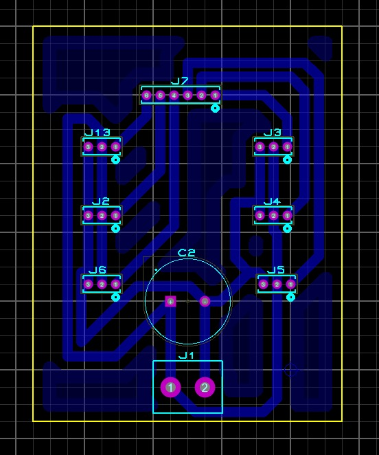
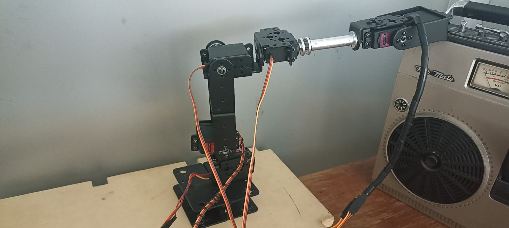

# Implementación de Brazo Robótico de 6GDL Controlado por App Móvil
Este proyecto presenta la implementación de un brazo robótico de 6 grados de libertad (6GDL) controlado por una aplicación móvil. El brazo fue programado en Python y se comunica vía Bluetooth con la aplicación, permitiendo al usuario seleccionar entre dos modos de operación: cinemática directa y cinemática inversa. En el modo de cinemática directa, el usuario ingresa un vector de valores para cada GDL y el sistema devuelve un vector de ángulos de Euler. En el modo de cinemática inversa, el usuario ingresa un vector de ángulos de Euler y el sistema devuelve un vector de ángulos para cada GDL.


- **Autor:** Mario Airy Hernandez Osorio
- **Institución:** Universidad Autónoma de Querétaro (UAQ)
- **Curso:** Robótica
- **Instructor:** Dr. Gerardo Pérez Soto
- **Año:** 2024-1

---

# 1. Modelado Matematico
Éstos parámetros se calcularon según la convención proximal de Denavit-Hartenberg
## 1.1 Parametros de Denavit-Hartenberg
### Descripción de Parámetros

- **$l_1$**: Es la distancia del eslabón 1.
- **$l_2$**: Es la distancia del eslabón 2.
- **$l_3$**: Es la distancia del eslabón 3.
- **$l_4$**: Es la distancia del eslabón 4.
- **$\theta_i$**: Son los valores de los ángulos para cada motor.

### Tabla de Parámetros de Denavit-Hartenberg del Robot

| **art** | $\boldsymbol{\theta_i}$ | $\boldsymbol{d_i}$ | $\boldsymbol{a_i}$ | $\boldsymbol{\alpha_i}$ |
|---------|--------------------------|-------------------|-------------------|--------------------------|
| 1       | $\theta_1$               | $l_1$             | 0                 | 90                       |
| 2       | $\theta_2$               | 0                 | $l_2$             | 0                        |
| 3       | $\theta_3$               | 0                 | 0                 | 90                       |
| 4       | $\theta_4$               | $l_3$             | 0                 | -90                      |
| 5       | $\theta_5$               | 0                 | 0                 | 90                       |
| 6       | $\theta_6$               | $l_4$             | 0                 | 0                        |

## 1.2 Cinemática Directa
La cinemática directa es una técnica utilizada en robótica para determinar la posición y orientación del actuador final (extremo) de un robot a partir de sus parámetros articulares. Para un robot de 6 Grados de Libertad (GDL), esto implica calcular la posición y orientación del extremo en el espacio tridimensional usando las longitudes de los eslabones y los ángulos de las articulaciones.

Para un robot de 6 GDL, se construyen 6 matrices de transformación homogénea, cada una correspondiente a una articulación del robot. Estas matrices se multiplican secuencialmente para obtener la Matriz de Transformación Homogénea (MTH) total del robot, que describe la posición y orientación del actuador final en el espacio.

## 1.3 Cinemática Inversa
La cinemática inversa es una técnica utilizada en robótica para determinar los ángulos articulares de un robot a partir de una posición y orientación deseadas del actuador final (extremo). Para un robot de 6 Grados de Libertad (GDL), esto implica calcular los ángulos de cada una de las articulaciones necesarias para que el extremo del robot alcance una posición y orientación específicas en el espacio tridimensional.

La cinemática inversa es fundamental en aplicaciones robóticas que requieren precisión en la manipulación y el movimiento del robot. Permite que el actuador final alcance posiciones y orientaciones específicas de manera controlada y eficiente.

Para mas información al respecto favor de checar el pdf incluido 
[documento PDF](./Recursos_Adicionales/Análisis_Cinemático_de_un_Robot_de_6_GDL.pdf).

---
# 2. Descripcion de los codigos

## 2.1 Principal
Nombre del Codigo "main.py"
### Funcionalidad
Este código actúa como el controlador principal para un brazo robótico de 6 grados de libertad (6GDL), permitiendo su operación y control mediante una conexión Bluetooth desde una aplicación móvil. Facilita dos modos de operación clave: cinemática directa y cinemática inversa.

### Características
- Comunicación Bluetooth: Permite la comunicación bidireccional entre la aplicación móvil y el controlador del brazo robótico.
- Modo de Cinemática Directa: Transforma un vector de entrada en ángulos de Euler para posicionar el brazo robótico.
- Modo de Cinemática Inversa: Calcula ángulos de Euler a partir de un vector de entrada para configurar los grados de libertad del brazo.
- Verificación de Ángulos: Asegura que los ángulos calculados estén dentro del rango operativo antes de enviarlos al brazo.
- Integración Serial: Utiliza comunicación serial para enviar comandos de posición al brazo robótico.
- Interfaz con Aplicación Móvil: Gestiona la recepción de datos desde la aplicación móvil y envía los resultados de vuelta según el modo de operación seleccionado.

## 2.2 Gestión de Comunicación Bluetooth 
Nombre del Codigo "BT.py"
### Funcionalidad
Este código proporciona funcionalidades para establecer y gestionar la comunicación Bluetooth entre un controlador y una aplicación móvil para controlar un brazo robótico. Permite actuar tanto como cliente como servidor Bluetooth según las necesidades de conexión.

### Características
- Modo Cliente y Servidor: Puede operar como cliente o servidor Bluetooth dependiendo de la configuración inicial.
- Recepción y Envío de Datos: Capaz de recibir y enviar datos a través de la conexión Bluetooth.
- Notificación de Conexión: Informa sobre cambios en el estado de la conexión Bluetooth.
- Interfaz de Callback: Utiliza una función de callback (onRecive) para manejar los datos recibidos.
- Envío de Datos Recibidos: En modo cliente, automáticamente reenvía los datos recibidos.
- Detención de Servicio: Permite detener el servidor Bluetooth cuando sea necesario.

## 2.3 Conexión Serial para Comunicación con Microcontrolador
Nombre del Codigo "Serial.py"
### Funcionalidad
Este código facilita la comunicación bidireccional a través de un puerto serial entre un sistema de control y un dispositivo Arduino. Permite enviar datos desde el sistema de control al Arduino y viceversa.

### Características
- Conexión Serial: Establece una conexión serial con el Arduino utilizando el puerto especificado y un baudrate de 9600 por defecto.
- Envío de Datos: Capaz de enviar datos al Arduino, asegurando que el formato de los datos sea válido antes de la transmisión.
- Validación de Datos: Verifica que los datos a enviar al Arduino estén en el formato correcto (se espera un string con seis valores separados por comas).
- Gestión de Conexión: Maneja la apertura y cierre adecuados del puerto serial.
- Precisión de Pines Analógicos: Utiliza la conexión serial debido a la mayor precisión y control que ofrece sobre los pines analógicos del Arduino.

## 2.4 Cálculo de Ángulos de Euler Mediante Cinemática Directa
Nombre del Código "Cinematica_directa.py
### Funcionalidad
Este código implementa la cinemática directa para un brazo robótico de 6 grados de libertad (6GDL), calculando los ángulos de Euler correspondientes a una posición especificada en el espacio. Utiliza la matriz de transformación homogénea (MTH) para determinar la orientación y posición del actuador final del brazo robótico.

### Características
- Configuración de Parámetros DH: Define las longitudes y ángulos de los parámetros de Denavit-Hartenberg (DH) que describen la estructura cinemática del brazo robótico.
- Transformación Homogénea: Calcula la matriz de transformación homogénea desde la base hasta el actuador final utilizando los parámetros DH y los ángulos de entrada.
- Cálculo de Ángulos de Euler: Utiliza la matriz de rotación de la MTH para obtener los ángulos de Euler que describen la orientación del actuador final en el espacio.
- Conversión de Unidades: Convierte los ángulos de entrada de grados a radianes antes de realizar los cálculos.
- Manejo de Errores: Captura y maneja excepciones para asegurar que los datos de entrada estén correctamente formateados y sean válidos.

Mas informacion en la sección 3.1 del pdf adjunto
[documento PDF](./Recursos_Adicionales/Análisis_Cinemático_de_un_Robot_de_6_GDL.pdf).

## 2.5 Cálculo de Ángulos para Grados de Libertad (GDL) de un Brazo Robótico
Nombre del Código "desacoplo.py"
### Funcionalidad
Este código realiza el cálculo de los ángulos necesarios para cada articulacion de un brazo robótico de 6 GDL. Utiliza los ángulos de Euler y la posición especificada para determinar las configuraciones articulares que posicionan el brazo en el espacio.

### Características
- Configuración de Parámetros DH: Define las longitudes y ángulos de los parámetros de Denavit-Hartenberg (DH) que describen la estructura cinemática del brazo robótico.
- Cálculo de Matriz de Transformación Homogénea: Calcula la matriz de transformación homogénea desde la base hasta el actuador final del brazo robótico utilizando los ángulos de Euler y la posición dada.
- Ángulos de Articulación 1 a 3: Determina los ángulos necesarios para los primeros tres grados de libertad del brazo robótico a partir de la posición calculada.
- Ángulos de Articulación 4 a 6: Calcula los ángulos restantes necesarios para los grados de libertad 4 a 6 utilizando la matriz de rotación resultante de la transformación 0-3.
- Conversión de Unidades: Convierte los ángulos de radianes a grados para facilitar la comprensión y configuración del brazo robótico.
- Manejo de Errores: Captura y maneja excepciones para asegurar que los datos de entrada estén correctamente formateados y sean válidos.

Mas informacion en la sección 3.2 del pdf adjunto
[documento PDF](./Recursos_Adicionales/Análisis_Cinemático_de_un_Robot_de_6_GDL.pdf).
imagen 1: Diagrama electrico de la placa en Eagle

---

## 3. Electrónica.
Para alimentar los 6 servomotores de nuestro robot utilizando una fuente externa de voltaje, hemos diseñado una placa electrónica específica. Utilizamos el software Eagle para crear el diagrama eléctrico. Los materiales necesarios para la construcción de esta placa son los siguientes:

- Capacitor: 2200 microFaradios
- Placa de cobre
- Clema: 2 entradas
- Pines de tipo macho
- Conectores Dupont

Estos componentes asegurarán una alimentación estable y segura para los servomotores, permitiendo un control eficiente y preciso del robot.




---

## 4. Resultados.

### 4.1 Robot empleado para el proyecto.


### 4.2 App Móvil.

### 4.3 Video de demostración.

[Ver el video en YouTube](https://youtu.be/IZDzBegQsG4)

---
## 5. Clonar repositorio.
Para crear una copia del proyecto puedes utilizar:

```
git clone [https://github.com/Airy0sorio/Robotica_2024_1_Airy](https://github.com/Airy0sorio/-Development-of-a-6-DOF-Robot-with-Decoupled-Kinematic-Control-Using-Servomotors-and-Raspberry-Pi)
```
---

## 6. Instrucciones para ejecutar los archivos en Python.

Este repositorio contiene archivos Python para ejecutar diversas funciones. Para hacerlo de manera efectiva, se recomienda utilizar el editor de código Visual Studio Code (VSCode).

### Requisitos previos.
Antes de ejecutar los programas, sigue estos pasos:

1. **Instalación de Python:**
   Asegúrate de tener Python instalado, se recomienda la versión 3.11.8.

2. **Creación de una carpeta de proyecto:**
   Crea una carpeta donde se guardarán los archivos y recursos del proyecto.

3. **Creación de un entorno virtual:**
   Abre la terminal integrada de VSCode y ejecuta el siguiente comando para crear un entorno virtual:
   ```
   python -m venv ./env
   ```

4. **Activación del entorno virtual:**
Activa el entorno virtual con el siguiente comando:
    ```
   .env\Scripts\activate
    ```

5. **Instalación de las librerías:**
Instala las librerías utilizadas en el proyecto ejecutando el siguiente comando:
    ```
   pip install -r requirements.txt
    ```

6.**Ejecución del programa**
Una vez configurado el entorno, puedes ejecutar el programa escribiendo el siguiente comando en la terminal:    
    
    python Nombre_del_archivo.py
    
    
Para futuras ejecuciones, simplemente activa el entorno virtual y ejecuta el archivo Python que deseas correr. 
Los pasos 4 y 6 son suficientes para ejecutar cualquier código adicional.


